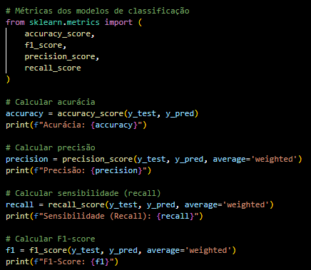

# Introdução

## Metodologia

&emsp;O projeto foi estruturado com base na metodologia CRISP-DM (Cross Industry Standard Process for Data Mining). Essa é uma abordagem presente na metodologia ágil, amplamente empregada em iniciativas que exploram o universo do Data Science e Machine Learning, especialmente em contextos caracterizados por volumes expressivos de dados.

&emsp;O CRISP-DM opera como um ciclo iterativo, uma vez que, dada a complexidade à manipulação e interpretação de vastos volumes de dados, é crucial proceder com avanços de etapa a etapa para alcançar um progresso gradual no ciclo do projeto. Essa metodologia apresenta seis estágios distintos, porém para esta primeira sprint de projeto a implementação do modelo será da etapa 1 até a etapa 5: Entendimento do Negócio, Entendimento dos Dados, Preparação dos Dados, Modelagem, Avaliação

Fonte: EBAC Online

&emsp;Entendimento do Negócio: A fase inicial do processo CRISP-DM, conhecida como Entendimento do Negócio, desempenha um papel crucial ao aprofundar-se na compreensão do panorama e do contexto em que o projeto está envolvido. Nesse estágio, busca-se adquirir conhecimento dos objetivos e exigências do projeto, além de mapear como esses objetivos se traduzem em desafios de análise de dados. Essa exploração inicial é fundamental, uma vez que estabelece fundamentos essenciais para a tomada de decisões estratégicas, desde o começo até os momentos futuros do projeto.

## Modelo

&emsp;O escolhido para a introdução desse projeto foi o Random Forest. “Em resumo, o Random Forest irá criar muitas árvores de decisão, de maneira aleatória”[1] e, em seguida, combina os resultados dessas árvores para formar um único resultado consolidado. Esse algoritmo encontra-se na biblioteca scikit-learn e baseia-se no conceito de ensemble learning, que envolve o uso de vários modelos para obter uma previsão, muito parecido com a abordagem de uma árvore de decisão tradicional. No entanto, o Random Forest utiliza diversas árvores de decisões para gerar a previsão esperada. É um modelo versátil e pode ser usado tanto para regressão ou classificação, forma escolhida nesse projeto para prever falhas na produção de automóveis na fábrica da Volkswagen. Devido a sua capacidade de lidar com o uso de diversas features e ao mecanismo de ensemble, esse modelo se torna muito eficiente em resultados com diversos tipos de problemas.

[1] DIDATICA TECH. O que é e como funciona o algoritmo RandomForest. Disponível em: https://didatica.tech/o-que-e-e-como-funciona-o-algoritmo-randomforest/. Acesso em: 15 ago. 2024.

## Métricas

&emsp;Na criação de um modelo preditivo, é essencial serem utilizados critérios para avaliar o desempenho deste. Desse modo, esses critérios são chamados de métricas e elas podem ser divididas em dois grupos: de regressão e de classificação. Assim, foram utilizadas métricas de classificação para avaliar o modelo preditivo desenvolvido pela equipe Käfer, uma vez que o modelo testado foi o Random Forest Classifier. As métricas escolhidas são: Acurácia, Precisão, Sensibilidade (Recall) e F1-Score. Além disso, é importante ressaltar que o grupo utilizou a biblioteca sklearn.metrics para realizar o cálculo das métricas, o que é apresentado no trecho de código abaixo:

Fonte: Elaborado pelo grupo Käfer

&emsp;Nesse sentido, a seguir serão apresentadas os significados das métricas de classificação utilizadas para avaliar o modelo preditivo:

    1. Acurácia:
    2. Precisão:
    3. Sensibilidade (Recall):
    4. F1-Score:

&emsp;Com base nos resultados que o algoritmo preditivo proporcionou, ao analisar as métricas obtidas é possível concluir que o modelo demonstrou um desempenho sólido ao prever a variável alvo ‘STATUS’, que mostra se a fabricação de um carro na fábrica da Volkswagen falhou ou não. A partir destas métricas de avaliação, é possível fazer previsões precisas e fornecer informações valiosas para tomar decisões informadas e estratégicas com base nas previsões do modelo, o que significa que o algoritmo está cumprindo com excelência seu propósito de executar previsões confiáveis.
