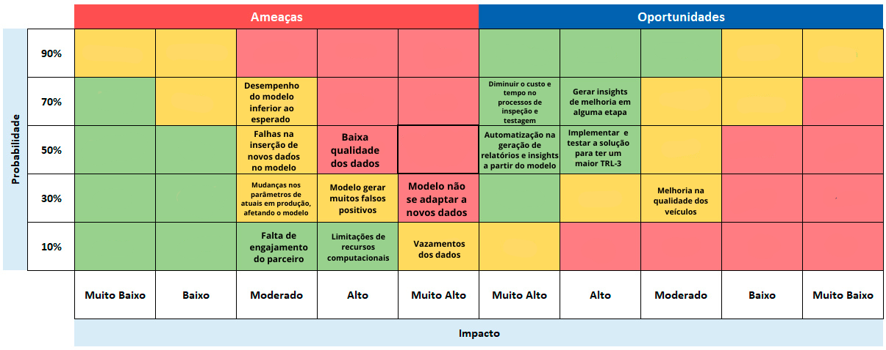

# Matriz de Risco

## Introdução

A matriz de riscos é uma ferramenta de análise de negócios e projeto, onde organizamos os riscos e oportunidades em uma tabela, onde as linhas são os riscos, e as colunas são os impactos e probabilidades. A partir disso, é possível identificar os riscos mais críticos e que requerem maior atenção e alocação de recursos para serem gerenciados. A matriz de risco que desenvolvemos considera o protótipo e o produto final do projeto.

<b> Figura 1 - Matriz de Risco</b>

  
  
<b>Fonte:</b> Elaborado por Grupo3

### Ameaças

- **Desempenho do modelo inferior ao esperado:** Probabilidade 70%, Impacto Alto
- **Baixa qualidade dos dados:** Probabilidade 50%, Impacto Muito Alto
- **Modelo gerar falsos positivos:** Probabilidade 50%, Impacto Alto
- **Modelo não se adaptar a novos dados:** Probabilidade 30%, Impacto Muito Alto
- **Falhas na inserção de novos dados no modelo:** Probabilidade 50%, Impacto Moderado
- **Mudanças nos parâmetros de atuais em produção, afetando o modelo:** Probabilidade 30%, Impacto Moderado
- **Modelo gerar muitos falsos positivos:** Probabilidade 30%, Impacto Alto
- **Falta de engajamento do parceiro:** Probabilidade 10%, Impacto Baixo
- **Limitações de recursos computacionais:** Probabilidade 30%, Impacto Moderado
- **Vazamentos dos dados:** Probabilidade 30%, Impacto Alto

### Oportunidades

- **Diminuir o custo e tempo no processo de inspeção e testagem:** Probabilidade 90%, Impacto Moderado
- **Gerar insights de melhoria em alguma etapa:** Probabilidade 70%, Impacto Alto
- **Implementar e testar a solução para ter um maior TRL-3:** Probabilidade 50%, Impacto Muito Alto
- **Melhoria na qualidade dos veículos:** Probabilidade 50%, Impacto Alto
- **Automatização na geração de relatórios e insights a partir do modelo:** Probabilidade 30%, Impacto Alto

# Plano de Ação para Riscos

### 1. Desempenho do modelo inferior ao esperado
- **Ação:** Realizar validações contínuas e ajustes no modelo utilizando diferentes técnicas de machine learning, como ajuste de hiperparâmetros, validação cruzada e teste com diferentes algoritmos.

### 2. Baixa qualidade dos dados
- **Ação:** Implementar um processo forte de limpeza e pré-processamento dos dados. Considerar a utilização de técnicas de imputação de valores ausentes e normalização dos dados.

### 3. Modelo gerar falsos positivos
- **Ação:** Balancear as classes no conjunto de dados de treinamento, ajustar o threshold de classificação e realizar tuning dos parâmetros do modelo.

### 4. Modelo não se adaptar a novos dados
- **Ação:** Estabelecer um processo de re-treinamento mensal do modelo com dados novos e atualizados para garantir a adaptação às mudanças na produção.

### 5. Falhas na inserção de novos dados no modelo
- **Ação:** Automatizar o pipeline de ingestão de dados e implementar verificações de qualidade para garantir que os novos dados sejam inseridos corretamente.

### 6. Mudanças nos parâmetros de atuais em produção, afetando o modelo
- **Ação:** Criar um mecanismo de feedback para capturar mudanças nos parâmetros de produção e ajustar o modelo em tempo real ou durante o re-treinamento.

### 7. Falta de engajamento do parceiro
- **Ação:** Manter uma comunicação constante e transparente com o parceiro e tirar o maximo das reuniões de alinhamento de cada sprints.

### 8. Limitações de recursos computacionais
- **Ação:** Utilizar os supercomputadores do laboratório.

### 9. Vazamentos dos dados
- **Ação:** Manter os dados em ambientes seguros e não subir dados sensíveis para repositórios públicos.

## Conclusão

A matriz de riscos é uma ferramenta essencial para o gerenciamento de riscos em projeto e durante as próximas sprints, será utilizada para monitorar e controlar os riscos identificados. O plano de ação proposto visa mitigar os riscos e aproveitar as oportunidades identificadas, garantindo um proejto eficiente e que gere valor para o cliente.